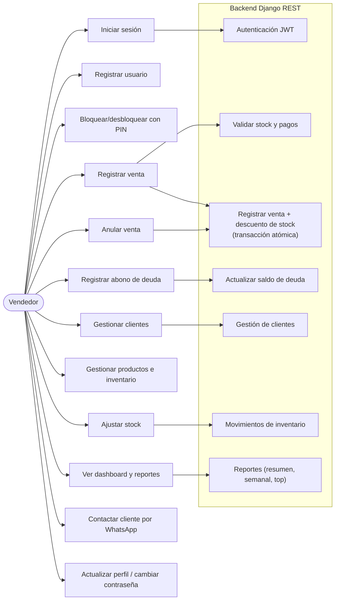
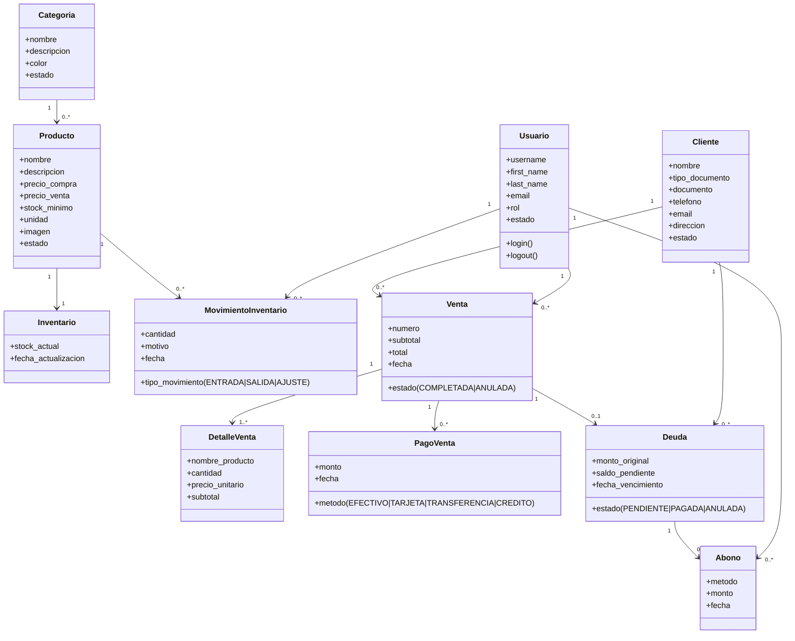
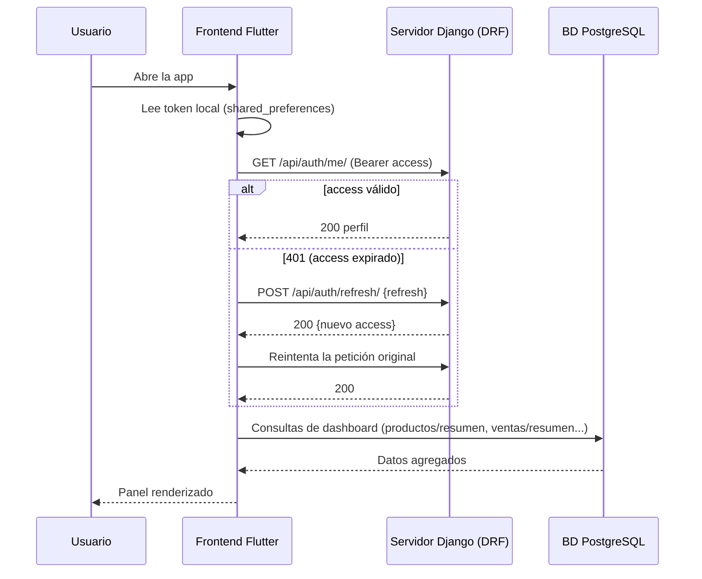
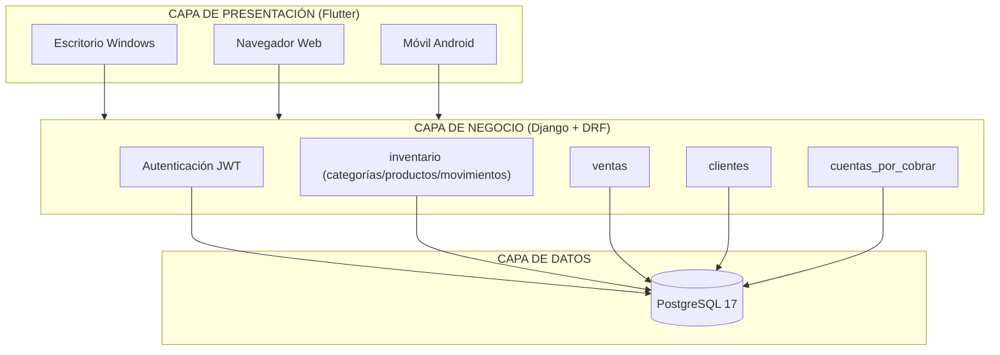
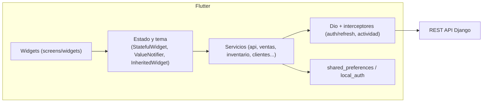
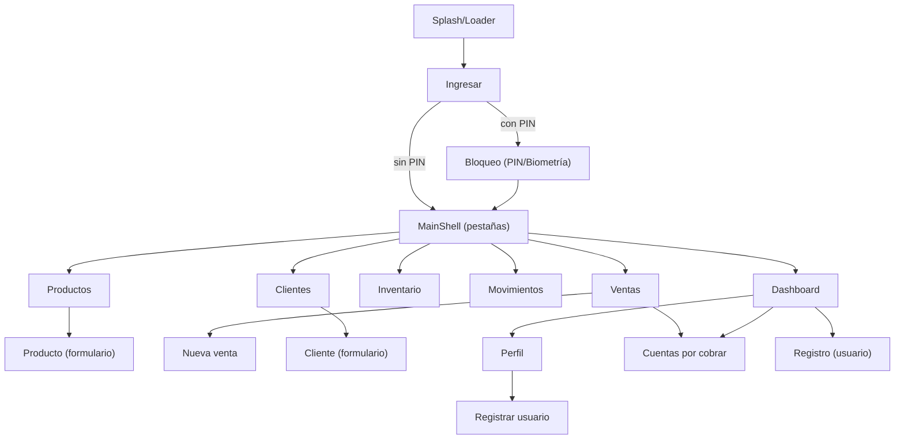

# LicorStock — Análisis, Diseño e Implementación de una aplicación de escritorio, web y móvil

**Caso práctico:** Sistema de gestión de una licorería (productos, inventario, ventas, clientes, pagos y cuentas por cobrar).
**Integrantes/carrera:** *(completar)*
**Fecha:** *(completar)*

---

## Respuestas ejecutivas a las preguntas guía

1. **Requerimientos esenciales (funcionales y no funcionales).** Los funcionales se desglosan en la sección 1.2 (autenticación JWT, gestión de productos/inventario via `categorias`, `productos`, `movimientos`, registro y anulación de ventas con pagos mixtos, clientes, deudas y abonos, consulta diaria/semanal de reportes). Los no funcionales (sección 1.3) garantizan: **seguridad** (JWT con refresh, expiración por inactividad de 5 min, PIN opcional y biometría), **usabilidad** (tema claro/oscuro/sistema, navegación por pestañas), **rendimiento** (tiempos de espera con límite, carga optimizada con `select_related`/`prefetch_related`), **portabilidad multi‑plataforma** (una sola base de código Flutter para Windows, web y Android), **mantenibilidad** e **integridad** (pagos y stock en transacciones atómicas).

2. **Metodología más adecuada.** **Iterativa incremental (estilo SCRUM adaptado)** a un equipo pequeño: se entrega el sistema en incrementos funcionales y verificables (backend de API → frontend Flutter → autenticación → inventario → ventas → cuentas por cobrar). Influye en la planificación porque cada iteración termina con un **incremento compilable y probado** (`flutter analyze` a cero errores, `flutter build web`, `apk`, `windows` como hitos), y los requisitos pueden ajustarse entre ciclos sin rehacer todo.

3. **Diseño de base de datos.** 11 tablas normalizadas a la **3FN** (sección 2), con `MER` y modelo relacional, todas con prefijo `LS_`. Integridad por **claves foráneas** + transacciones (`@transaction.atomic` en venta/anulación/ajuste), eficiencia con **índices** y consultas de agregado en el motor (`Sum`, `Count`, `Coalesce`), escalabilidad por separación de responsabilidades por dominio (inventario, ventas, cuentas por cobrar) que permite particionar o cachear por módulo.

4. **Arquitectura, paradigma y patrones.** **Arquitectura cliente–servidor de tres capas** (presentación Flutter → API REST Django/DRF → datos PostgreSQL), **paradigma orientado a objetos** (Dart/Python) combinado con **funcional** (inmutabilidad, colecciones). Patrones aplicados: **Modelo–Vista–Controlador ampliado (Widgets como vista + `State` como controlador)**, **Repository** (capa `services/` que aísla Dio), **Singleton** (`api`, `ThemeController`, `authService`), **Adapter/Interceptor** (Dio), **Observer** (`ValueNotifier` + `AnimatedBuilder`, `InheritedWidget` en `MainShellScope`/`ThemeScope`), **Factory** (serializers y elecciones del dominio), **Strategy** (métodos de pago).

5. **Diseño de interfaz.** Navegación por **pestañas** (Dashboard, Productos, Inventario, Movimientos, Ventas, Clientes) sobre una marca visual dorada; **mockups** en 4.2 y un **prototipo funcional** real (la propia app compilada para web/escritorio/móvil). Se garantiza fluidez con `IndexedStack` (todas las pestañas vivas), indicadores de carga (`Esqueleto`), estados vacíos con acciones ("Reintentar") y diseño responsive que se adapta a escritorio, tablet y teléfono.

6. **Implementación, documentación y presentación.** Proceso por hitos verificables (5.1), pruebas funcionales y de integración contra la API real (5.4), documentación técnica y del funcionamiento (sección 8) y guion de presentación oral con apoyo visual (sección 8.1). El cierre incluye **conclusiones**, **recomendaciones** y **referencias**.

---

## 1. ANÁLISIS Y DISEÑO

### 1.1 Estudio de factibilidad

| Tipo | Análisis | Veredicto |
|---|---|---|
| **Técnica** | Stack maduro y multiplataforma: Flutter 3.41 (Dart 3.11) compila a Windows, web y Android desde un único código; Django 5.2 + DRF sobre PostgreSQL 17. Comunicación REST con JWT. Sin dependencias de terceros riesgosas. | Factible |
| **Operativa** | Usuarios con perfil no técnico (vendedor/administrador). La interfaz es por pestañas, con búsqueda, confirmaciones y mensajes de error amigables. Se puede operar en un dispositivo móvil como caja, y desde escritorio/web para reportes. | Factible |
| **Económica** | Software libre y gratuito (Flutter, Django, PostgreSQL); se ejecuta en la infraestructura existente o en máquinas de bajo costo (un servidor local para la API y la BD). | Factible |
| **Legal/ética** | Datos locales del negocio; las credenciales se almacenan con JWT y PIN con hash (SHA‑256). No se exponen datos personales de terceros. | Factible |

### 1.2 Requerimientos funcionales

| Código | Requerimiento | Módulo |
|---|---|---|
| RF‑01 | El sistema debe permitir el **registro** de un nuevo usuario (usuario, correo, nombres, contraseña y confirmación). | Autenticación |
| RF‑02 | El sistema debe permitir **iniciar sesión** validando credenciales y emitir un token de acceso (JWT) con token de refresco. | Autenticación |
| RF‑03 | El sistema debe **cerrar la sesión** invalidando el token y limpiando el almacenamiento local. | Autenticación |
| RF‑04 | El sistema debe permitir **consultar y actualizar el perfil** y cambiar la contraseña. | Autenticación |
| RF‑05 | El sistema debe solicitar un **PIN de bloqueo** opcional al abrir la sesión y validarlo. | Seguridad |
| RF‑06 | El sistema debe soportar **desbloqueo biométrico** (huella/reconocimiento facial) cuando el equipo lo permite. | Seguridad |
| RF‑07 | El sistema debe **expirar la sesión por inactividad** (5 minutos) y devolver al login. | Seguridad |
| RF‑08 | El sistema debe mostrar un **panel de control** con ventas de hoy, ingresos de hoy, unidades en inventario, cuentas por cobrar y bajo stock, más la gráfica de los últimos 7 días y ventas recientes. | Dashboard |
| RF‑09 | El dashboard debe consultar los reportes `resumen`, `semanal`, `top_productos`, `productos/resumen`, `bajo_stock`, `deudas/resumen`. | Dashboard |
| RF‑10 | El sistema debe **gestionar productos**: listar, buscar, crear, editar (incluida imagen), activar/desactivar y eliminar. | Productos |
| RF‑11 | El sistema debe gestionar **categorías** de productos (nombre, color, activo). | Inventario |
| RF‑12 | El sistema debe registrar el **stock actual** de cada producto ("inventario") y el **stock mínimo** para alerta de bajo stock. | Inventario |
| RF‑13 | El sistema debe registrar **movimientos de inventario** (ENTRADA/SALIDA/AJUSTE) con motivo y usuario que los realiza. | Inventario |
| RF‑14 | El sistema debe permitir **ajustar el stock** indicando la cantidad final o la cantidad movida y el motivo. | Inventario |
| RF‑15 | El sistema debe **registrar ventas** con uno o varios productos, cantidades y pagos mixtos (EFECTIVO, TARJETA, TRANSFERENCIA; CREDITO automático si queda saldo). | Ventas |
| RF‑16 | El sistema debe **descontar stock** al crear la venta y registrarlo como movimiento SALIDA, todo en una transacción. | Ventas |
| RF‑17 | El sistema debe validar **stock suficiente** y consolidar los productos duplicados. | Ventas |
| RF‑18 | El sistema debe **anular ventas** restituyendo el stock (movimiento ENTRADA) siempre que la deuda asociada no tenga abonos. | Ventas |
| RF‑19 | El sistema debe listar y consultar **ventas** (detalles, pagos, estado Activa/Anulada, pagado, saldo) con filtros por búsqueda, cliente y estado. | Ventas |
| RF‑20 | El sistema debe **gestionar clientes** (crear, editar, listar con búsqueda y filtro de estado, activar/desactivar). | Clientes |
| RF‑21 | El sistema debe generar una **deuda** automáticamente cuando una venta a crédito o con pago parcial queda con saldo. | Cuentas por cobrar |
| RF‑22 | El sistema debe registrar **abonos** sobre las deudas (monto y método) y mantener el **saldo pendiente** actualizado. | Cuentas por cobrar |
| RF‑23 | El sistema debe marcar la deuda como **PAGADA** cuando el saldo llega a cero. | Cuentas por cobrar |
| RF‑24 | El sistema debe permitir **contactar al cliente por WhatsApp** desde el detalle de la deuda. | Cuentas por cobrar |
| RF‑25 | El sistema debe funcionar en **escritorio (Windows), web y móvil (Android)** con la misma experiencia. | Multi‑plataforma |
| RF‑26 | El sistema debe guardar la sesión y preferencias (tema) **localmente** y no pedir contraseña en cada arranque dentro del tiempo de actividad. | Sesión |

### 1.3 Requerimientos no funcionales

| Código | Categoría | Requerimiento |
|---|---|---|
| RNF‑01 | Usabilidad | Interfaz consistente (paleta, tipografía, iconos), con estados de carga (esqueletos), vacíos y errores con acción "Reintentar". |
| RNF‑02 | Rendimiento | Límite de tiempo de espera de red de 10 s; listas optimizadas con `select_related`/`prefetch_related`; respuestas de agregados calculadas en el motor. |
| RNF‑03 | Seguridad | Contraseñas con hash (Django), tokens JWT con refresh automático, PIN con SHA‑256, no almacenar datos sensibles en claro. |
| RNF‑04 | Portabilidad | Un solo código base Flutter que compile a Windows, web y Android; base URL de API configurable por plataforma (`--dart-define`). |
| RNF‑05 | Compatibilidad | Emulador Android usa `10.0.2.2`; escritorio/web usan `localhost`; en dispositivos físicos se configura la IP de la red local. |
| RNF‑06 | Escalabilidad | Separación por dominios (app de Django): `inventario`, `clientes`, `ventas`, `cuentas_por_cobrar`, `usuarios`; consultas agregadas en BD. |
| RNF‑07 | Mantenibilidad | Arquitectura por capas (servicios/screens/widgets/tema); `flutter analyze` a **cero errores y warnings**. |
| RNF‑08 | Disponibilidad | Backend local/único; reinicio simple con `runserver`; respaldo de la BD PostgreSQL. |
| RNF‑09 | Accesibilidad | Contraste temático (claro/oscuro), tamaños legibles, acciones táctiles amplias y navegación de una mano para móvil. |

### 1.4 Metodología de desarrollo seleccionada

**Iterativa incremental (adaptación de SCRUM para equipo pequeño).**

**Justificación:** el proyecto tiene un alcance amplio (3 plataformas + API + BD) pero un equipo reducido, por lo que una metodología en cascada exigiría especificar todo por adelantado y retrasaría la obtención de resultados visibles. La iterativa incremental entrega **incrementos funcionales y compilables** en cada ciclo (sprint), permite ajustar requisitos con retroalimentación temprana y reduce el riesgo técnico de la portabilidad Flutter.

**Cómo influye en la planificación:**

- **Sprint 0 – Fundaciones:** infraestructura (backend Django + PostgreSQL, esqueleto Flutter multiplataforma), convenciones.
- **Sprint 1 – Autenticación:** login/registro, JWT con refresh, perfil, PIN, biometría, expiración por inactividad.
- **Sprint 2 – Catálogo e inventario:** categorías, productos (imagen), inventario, movimientos y ajustes, dashboard parcial.
- **Sprint 3 – Ventas y cobranza:** venta nueva con pagos mixtos, anulación, clientes, deudas y abonos.
- **Sprint 4 – Dashboard y reportes:** resumen, semanal, top productos, bajo stock, cuentas por cobrar.
- **Sprint 5 – Cierre y despliegue:** `flutter analyze` en cero, builds de web/Windows/APK, pruebas de integración y documentación.

Cada sprint termina con **criterio de aceptación**: análisis estático limpio + build de al menos una plataforma + prueba funcional de los módulos del sprint.

### 1.5 Diagrama de casos de uso



### 1.6 Diagrama de clases



En el frontend Flutter, la "vista" se modela con widgets: `LoginScreen`, `RegistroScreen`, `BloqueoScreen` (PIN), `DashboardScreen`, `ProductosScreen`, `InventarioScreen`, `MovimientosScreen`, `VentasScreen`, `VentaNuevaScreen`, `ClientesScreen`, `CuentasScreen`, `PerfilScreen`; la "capa de acceso a datos" con los repositorios `AuthServicio`, `ProductosServicio`, `CategoriasServicio`, `MovimientosServicio`, `ClientesServicio`, `VentasServicio`, `DeudasServicio`.

### 1.7 Diagrama de actividades — flujo de "Registrar venta"

```mermaid
flowchart TD
  INICIO([Vendedor pulsa "Nueva venta"]) --> BUSCAR["Buscar/agregar productos"]
  BUSCAR --> STOCK{"¿Hay stock suficiente?"}
  STOCK -- "No" --> ERROR["Mensaje: Stock insuficiente"]
  ERROR --> BUSCAR
  STOCK -- "Sí" --> PAGOS["Capturar pagos mixtos<br/>(Efectivo/Tarjeta/Transferencia)"]
  PAGOS --> CREDITO{"¿Queda saldo pendiente?"}
  CREDITO -- "Sí" --> CLIENTE{"¿Cliente seleccionado?"}
  CLIENTE -- "No" --> REQUIERE["Pedir elegir cliente para crédito"]
  REQUIERE --> PAGOS
  CLIENTE -- "Sí" --> CREAR["POST /api/ventas/"]
  CREDITO -- "No" --> CREAR
  CREAR --> TX["Transacción: venta + detalle +<br/>descuento stock + movimiento SALIDA<br/>+ deuda (si aplica)"]
  TX --> OK["Notificación: Venta registrada"]
  OK --> FIN([Fin])
```

### 1.8 Diagrama de secuencia — restauración de sesión (JWT con refresh automático)



---

## 2. DISEÑO DE LA BASE DE DATOS

### 2.1 Modelo Entidad–Relación (MER)

```mermaid
erDiagram
  USUARIOS ||--o{ MOVIMIENTOS_INVENTARIO : realiza
  USUARIOS ||--o{ VENTAS : registra
  USUARIOS ||--o{ ABONOS : registra

  CATEGORIAS ||--o{ PRODUCTOS : clasifica
  PRODUCTOS ||--|| INVENTARIO : tiene
  PRODUCTOS ||--o{ MOVIMIENTOS_INVENTARIO : sufre
  PRODUCTOS ||--o{ DETALLES_VENTA : aparece_en

  CLIENTES ||--o{ VENTAS : compra
  CLIENTES ||--o{ DEUDAS : debe

  VENTAS ||--o{ DETALLES_VENTA : contiene
  VENTAS ||--o{ PAGOS_VENTA : recibe
  VENTAS ||--o| DEUDAS : genera

  DEUDAS ||--o{ ABONOS : recibe

  USUARIOS {
    int id PK
    varchar username
    varchar password
    varchar first_name
    varchar last_name
    varchar email
    varchar rol
    bool estado
    bool is_active
  }
  CATEGORIAS {
    int id PK
    varchar nombre
    varchar descripcion
    varchar color
    bool estado
  }
  PRODUCTOS {
    int id PK
    int categoria_id FK
    varchar nombre
    decimal precio_compra
    decimal precio_venta
    int stock_minimo
    varchar unidad
    varchar imagen
    bool estado
  }
  INVENTARIO {
    int id PK
    int producto_id FK(UNIQUE)
    int stock_actual
    timestamp fecha_actualizacion
  }
  MOVIMIENTOS_INVENTARIO {
    int id PK
    int producto_id FK
    int usuario_id FK
    varchar tipo_movimiento
    int cantidad
    varchar motivo
    timestamp fecha
  }
  CLIENTES {
    int id PK
    varchar nombre
    varchar tipo_documento
    varchar documento UNIQUE
    varchar telefono
    varchar email
    varchar direccion
    bool estado
    timestamp fecha_creacion
  }
  VENTAS {
    int id PK
    varchar numero UNIQUE
    int cliente_id FK
    int usuario_id FK
    decimal subtotal
    decimal total
    varchar estado
    timestamp fecha
  }
  DETALLES_VENTA {
    int id PK
    int venta_id FK
    int producto_id FK
    varchar nombre_producto
    int cantidad
    decimal precio_unitario
    decimal subtotal
  }
  PAGOS_VENTA {
    int id PK
    int venta_id FK
    varchar metodo
    decimal monto
    timestamp fecha
  }
  DEUDAS {
    int id PK
    int cliente_id FK
    int venta_id FK(UNIQUE)
    decimal monto_original
    decimal saldo_pendiente
    varchar estado
    timestamp fecha_inicio
    timestamp fecha_vencimiento
  }
  ABONOS {
    int id PK
    int deuda_id FK
    varchar metodo
    decimal monto
    int usuario_id FK
    timestamp fecha
  }
```

### 2.2 Modelo relacional (normalizado a la 3FN)

Notación: PK = clave primaria, FK = clave foránea, UQ = único.

- **LS_USUARIOS**(`id` PK, `username` UQ, `password`, `first_name`, `last_name`, `email` UQ, `is_staff`, `is_active`, `rol`, `estado`, `date_joined`)
- **LS_CATEGORIAS**(`id` PK, `nombre`, `descripcion`, `color`, `estado`)
- **LS_PRODUCTOS**(`id` PK, `categoria_id` FK→LS_CATEGORIAS, `nombre`, `descripcion`, `precio_compra`, `precio_venta`, `stock_minimo`, `unidad`, `imagen`, `estado`)
- **LS_INVENTARIO**(`id` PK, `producto_id` FK→LS_PRODUCTOS UQ, `stock_actual`, `fecha_actualizacion`)
- **LS_MOVIMIENTOS_INVENTARIO**(`id` PK, `producto_id` FK→LS_PRODUCTOS, `usuario_id` FK→LS_USUARIOS, `tipo_movimiento`, `cantidad`, `motivo`, `fecha`)
- **LS_CLIENTES**(`id` PK, `nombre`, `tipo_documento`, `documento` UQ, `telefono`, `email`, `direccion`, `estado`, `fecha_creacion`)
- **LS_VENTAS**(`id` PK, `numero` UQ, `cliente_id` FK→LS_CLIENTES, `usuario_id` FK→LS_USUARIOS, `subtotal`, `total`, `estado`, `fecha`)
- **LS_DETALLES_VENTA**(`id` PK, `venta_id` FK→LS_VENTAS, `producto_id` FK→LS_PRODUCTOS, `nombre_producto`, `cantidad`, `precio_unitario`, `subtotal`)
- **LS_PAGOS_VENTA**(`id` PK, `venta_id` FK→LS_VENTAS, `metodo`, `monto`, `fecha`)
- **LS_DEUDAS**(`id` PK, `cliente_id` FK→LS_CLIENTES, `venta_id` FK→LS_VENTAS UQ, `monto_original`, `saldo_pendiente`, `estado`, `fecha_inicio`, `fecha_vencimiento`)
- **LS_ABONOS**(`id` PK, `deuda_id` FK→LS_DEUDAS, `metodo`, `monto`, `usuario_id` FK→LS_USUARIOS, `fecha`)

**Justificación de la normalización (3FN):**
- Se eliminan dependencias transitivas: los totales de venta son derivables pero se **almacenan como atributos calculados** (`subtotal`, `total`, `saldo_pendiente`) por desempeño, manteniendo la coherencia mediante transacciones atómicas, no mediante redundancia de datos remotos.
- Cada hecho se registra una sola vez (un movimiento de inventario es un hecho; una venta es un hecho; un abono es un hecho) y las FK garantizan integridad referencial.
- La relación venta→deuda es **1 a 1** (`venta_id` UQ) porque una venta genera a lo sumo una deuda (el total de crédito).
- Stock e inventario van en tabla aparte (`1 a 1` con producto) para no mezclar catálogo (productos) con existencias (inventario) y permitir historial de movimientos en su propia tabla.

### 2.3 Diccionario de datos (resumen por entidad)

| Tabla | Campo | Tipo | Descripción |
|---|---|---|---|
| LS_USUARIOS | id | INT (PK, auto) | Identificador |
| | username | VARCHAR(150) UQ | Cuenta de acceso |
| | password | VARCHAR(128) | Hash (django auth) |
| | email | VARCHAR(254) UQ | Correo |
| | first_name / last_name | VARCHAR(150) | Nombres y apellidos |
| | rol | VARCHAR(20) | ADMIN / VENDEDOR |
| | estado | BOOLEAN | Activo/suspendido |
| | is_active | BOOLEAN | Activo del framework |
| LS_CATEGORIAS | id | INT (PK) | Identificador |
| | nombre | VARCHAR(100) | Nombre de categoría |
| | descripcion | TEXT | Descripción opcional |
| | color | VARCHAR(9) | Hex `#RRGGBB` |
| | estado | BOOLEAN | Activa |
| LS_PRODUCTOS | id | INT (PK) | Identificador |
| | categoria_id | INT FK | Categoría |
| | nombre | VARCHAR(200) | Nombre del producto |
| | precio_compra | DECIMAL(10,2) | Costo unitario |
| | precio_venta | DECIMAL(10,2) | Precio unitario |
| | stock_minimo | INT | Umbral de bajo stock |
| | unidad | VARCHAR(20) | UNIDAD, ML, LT, KG, G, CAJA, PACK, SIXPACK |
| | imagen | VARCHAR(100) | Ruta de imagen |
| | estado | BOOLEAN | Activo para la venta |
| LS_INVENTARIO | id | INT (PK) | Identificador |
| | producto_id | INT FK UQ | Producto |
| | stock_actual | INT | Existencias actuales |
| | fecha_actualizacion | TIMESTAMP | Último cambio |
| LS_MOVIMIENTOS_INVENTARIO | id | INT (PK) | Identificador |
| | producto_id | INT FK | Producto |
| | usuario_id | INT FK | Responsable |
| | tipo_movimiento | VARCHAR(20) | ENTRADA / SALIDA / AJUSTE |
| | cantidad | INT | Cantidad movida |
| | motivo | VARCHAR(255) | Razón |
| | fecha | TIMESTAMP | Fecha/hora |
| LS_CLIENTES | id | INT (PK) | Identificador |
| | nombre | VARCHAR(200) | Nombre/razón social |
| | tipo_documento | VARCHAR(20) | CEDULA / RUC / CONSUMIDOR |
| | documento | VARCHAR(20) UQ | N° documento |
| | telefono | VARCHAR(20) | Celular (para WhatsApp) |
| | email | VARCHAR(254) | Correo opcional |
| | direccion | VARCHAR(255) | Dirección |
| | estado | BOOLEAN | Activo |
| | fecha_creacion | TIMESTAMP | Alta |
| LS_VENTAS | id | INT (PK) | Identificador |
| | numero | VARCHAR(20) UQ | `FV-000001` |
| | cliente_id | INT FK NULL | Cliente (null = mostrador) |
| | usuario_id | INT FK NULL | Vendedor |
| | subtotal / total | DECIMAL(12,2) | Importes |
| | estado | VARCHAR(20) | COMPLETADA / ANULADA |
| | fecha | TIMESTAMP | Fecha/hora |
| LS_DETALLES_VENTA | id | INT (PK) | Identificador |
| | venta_id | INT FK | Venta |
| | producto_id | INT FK NULL | Producto (histórico) |
| | nombre_producto | VARCHAR(200) | Copia del nombre (histórico) |
| | cantidad | INT | Unidades |
| | precio_unitario | DECIMAL(10,2) | Precio al momento |
| | subtotal | DECIMAL(12,2) | Línea |
| LS_PAGOS_VENTA | id | INT (PK) | Identificador |
| | venta_id | INT FK | Venta |
| | metodo | VARCHAR(20) | EFECTIVO/TARJETA/TRANSFERENCIA/CREDITO |
| | monto | DECIMAL(12,2) | Importe del pago |
| | fecha | TIMESTAMP | Fecha/hora |
| LS_DEUDAS | id | INT (PK) | Identificador |
| | cliente_id | INT FK | Deudor |
| | venta_id | INT FK UQ | Venta origen |
| | monto_original | DECIMAL(12,2) | Crédito inicial |
| | saldo_pendiente | DECIMAL(12,2) | Saldo vigente |
| | estado | VARCHAR(20) | PENDIENTE/PAGADA/ANULADA |
| | fecha_inicio | TIMESTAMP | Alta |
| | fecha_vencimiento | TIMESTAMP NULL | Opcional |
| LS_ABONOS | id | INT (PK) | Identificador |
| | deuda_id | INT FK | Deuda abonada |
| | metodo | VARCHAR(20) | Método |
| | monto | DECIMAL(12,2) | Valor |
| | usuario_id | INT FK NULL | Quién lo registra |
| | fecha | TIMESTAMP | Fecha/hora |

### 2.4 Script SQL de creación (PostgreSQL 17)

Prefijo `LS_` (iniciales de **L**ico**S**tock). Se incluye `ON DELETE` coherente con el modelo Django (`CASCADE`/`SET NULL`) y los índices que usan las consultas frecuentes.

```sql
-- ============================================================
-- LicorStock - Script de creación de la base de datos
-- Motor PostgreSQL 17 | Charset UTF8 (estándar)
-- Prefijo de tablas: LS_ (iniciales de LicorStock)
-- ============================================================
CREATE DATABASE licorstock;
\connect licorstock

-- ------------------------------------------------------------
-- LS_USUARIOS (usuarios.Usuario - hereda AbstractUser)
-- ------------------------------------------------------------
CREATE TABLE LS_USUARIOS (
  id            INTEGER GENERATED BY DEFAULT AS IDENTITY PRIMARY KEY,
  password      VARCHAR(128) NOT NULL,
  last_login    TIMESTAMP NULL,
  is_superuser  BOOLEAN NOT NULL DEFAULT FALSE,
  username      VARCHAR(150) NOT NULL UNIQUE,
  first_name    VARCHAR(150) NOT NULL DEFAULT '',
  last_name     VARCHAR(150) NOT NULL DEFAULT '',
  email         VARCHAR(254) NOT NULL UNIQUE,
  is_staff      BOOLEAN NOT NULL DEFAULT FALSE,
  is_active     BOOLEAN NOT NULL DEFAULT TRUE,
  date_joined   TIMESTAMP NOT NULL,
  rol           VARCHAR(20) NOT NULL DEFAULT 'VENDEDOR',
  estado        BOOLEAN NOT NULL DEFAULT TRUE
);

-- ------------------------------------------------------------
-- LS_CATEGORIAS (inventario.Categoria)
-- ------------------------------------------------------------
CREATE TABLE LS_CATEGORIAS (
  id          INTEGER GENERATED BY DEFAULT AS IDENTITY PRIMARY KEY,
  nombre      VARCHAR(100) NOT NULL,
  descripcion TEXT NULL,
  color       VARCHAR(9) NOT NULL DEFAULT '#C9A227',
  estado      BOOLEAN NOT NULL DEFAULT TRUE
);

-- ------------------------------------------------------------
-- LS_PRODUCTOS (inventario.Producto)
-- ------------------------------------------------------------
CREATE TABLE LS_PRODUCTOS (
  id            INTEGER GENERATED BY DEFAULT AS IDENTITY PRIMARY KEY,
  categoria_id  INT NOT NULL,
  nombre        VARCHAR(200) NOT NULL,
  descripcion   TEXT NULL,
  precio_compra DECIMAL(10,2) NOT NULL,
  precio_venta  DECIMAL(10,2) NOT NULL,
  stock_minimo  INT NOT NULL DEFAULT 5,
  unidad        VARCHAR(20) NOT NULL DEFAULT 'UNIDAD',
  imagen        VARCHAR(100) NULL,
  estado        BOOLEAN NOT NULL DEFAULT TRUE,
  CONSTRAINT fk_producto_categoria FOREIGN KEY (categoria_id)
    REFERENCES LS_CATEGORIAS(id) ON DELETE CASCADE,
  INDEX idx_producto_nombre (nombre),
  INDEX idx_producto_estado (estado)
);

-- ------------------------------------------------------------
-- LS_INVENTARIO (inventario.Inventario) - existencias 1:1 con producto
-- ------------------------------------------------------------
CREATE TABLE LS_INVENTARIO (
  id                   INTEGER GENERATED BY DEFAULT AS IDENTITY PRIMARY KEY,
  producto_id          INT NOT NULL UNIQUE,
  stock_actual         INT NOT NULL DEFAULT 0,
  fecha_actualizacion  TIMESTAMP NOT NULL DEFAULT CURRENT_TIMESTAMP,
  CONSTRAINT fk_inv_producto FOREIGN KEY (producto_id)
    REFERENCES LS_PRODUCTOS(id) ON DELETE CASCADE
);

-- ------------------------------------------------------------
-- LS_MOVIMIENTOS_INVENTARIO (inventario.MovimientoInventario)
-- tipo: ENTRADA | SALIDA | AJUSTE
-- ------------------------------------------------------------
CREATE TABLE LS_MOVIMIENTOS_INVENTARIO (
  id              INTEGER GENERATED BY DEFAULT AS IDENTITY PRIMARY KEY,
  producto_id     INT NOT NULL,
  usuario_id      INT NULL,
  tipo_movimiento VARCHAR(20) NOT NULL,
  cantidad        INT NOT NULL,
  motivo          VARCHAR(255) NULL,
  fecha           TIMESTAMP NOT NULL DEFAULT CURRENT_TIMESTAMP,
  CONSTRAINT fk_mov_producto FOREIGN KEY (producto_id)
    REFERENCES LS_PRODUCTOS(id) ON DELETE CASCADE,
  CONSTRAINT fk_mov_usuario FOREIGN KEY (usuario_id)
    REFERENCES LS_USUARIOS(id) ON DELETE SET NULL,
  INDEX idx_mov_producto_fecha (producto_id, fecha),
  INDEX idx_mov_tipo (tipo_movimiento)
);

-- ------------------------------------------------------------
-- LS_CLIENTES (clientes.Cliente)
-- ------------------------------------------------------------
CREATE TABLE LS_CLIENTES (
  id             INTEGER GENERATED BY DEFAULT AS IDENTITY PRIMARY KEY,
  nombre         VARCHAR(200) NOT NULL,
  tipo_documento VARCHAR(20) NOT NULL DEFAULT 'CEDULA',
  documento      VARCHAR(20) NULL UNIQUE,
  telefono       VARCHAR(20) NULL,
  email          VARCHAR(254) NULL,
  direccion      VARCHAR(255) NULL,
  estado         BOOLEAN NOT NULL DEFAULT TRUE,
  fecha_creacion TIMESTAMP NOT NULL DEFAULT CURRENT_TIMESTAMP,
  INDEX idx_cliente_nombre (nombre),
  INDEX idx_cliente_telefono (telefono)
);

-- ------------------------------------------------------------
-- LS_VENTAS (ventas.Venta) - estado: COMPLETADA | ANULADA
-- ------------------------------------------------------------
CREATE TABLE LS_VENTAS (
  id         INTEGER GENERATED BY DEFAULT AS IDENTITY PRIMARY KEY,
  numero     VARCHAR(20) NOT NULL UNIQUE,
  cliente_id INT NULL,
  usuario_id INT NULL,
  subtotal   DECIMAL(12,2) NOT NULL DEFAULT 0,
  total      DECIMAL(12,2) NOT NULL DEFAULT 0,
  estado     VARCHAR(20) NOT NULL DEFAULT 'COMPLETADA',
  fecha      TIMESTAMP NOT NULL DEFAULT CURRENT_TIMESTAMP,
  CONSTRAINT fk_venta_cliente FOREIGN KEY (cliente_id)
    REFERENCES LS_CLIENTES(id) ON DELETE SET NULL,
  CONSTRAINT fk_venta_usuario FOREIGN KEY (usuario_id)
    REFERENCES LS_USUARIOS(id) ON DELETE SET NULL,
  INDEX idx_venta_fecha (fecha),
  INDEX idx_venta_estado (estado),
  INDEX idx_venta_cliente (cliente_id)
);

-- ------------------------------------------------------------
-- LS_DETALLES_VENTA (ventas.DetalleVenta)
-- ------------------------------------------------------------
CREATE TABLE LS_DETALLES_VENTA (
  id               INTEGER GENERATED BY DEFAULT AS IDENTITY PRIMARY KEY,
  venta_id         INT NOT NULL,
  producto_id      INT NULL,
  nombre_producto  VARCHAR(200) NOT NULL,
  cantidad         INT NOT NULL,
  precio_unitario  DECIMAL(10,2) NOT NULL,
  subtotal         DECIMAL(12,2) NOT NULL,
  CONSTRAINT fk_det_venta FOREIGN KEY (venta_id)
    REFERENCES LS_VENTAS(id) ON DELETE CASCADE,
  CONSTRAINT fk_det_producto FOREIGN KEY (producto_id)
    REFERENCES LS_PRODUCTOS(id) ON DELETE SET NULL
);

-- ------------------------------------------------------------
-- LS_PAGOS_VENTA (ventas.PagoVenta)
-- metodo: EFECTIVO | TARJETA | TRANSFERENCIA | CREDITO
-- ------------------------------------------------------------
CREATE TABLE LS_PAGOS_VENTA (
  id       INTEGER GENERATED BY DEFAULT AS IDENTITY PRIMARY KEY,
  venta_id INT NOT NULL,
  metodo   VARCHAR(20) NOT NULL,
  monto    DECIMAL(12,2) NOT NULL,
  fecha    TIMESTAMP NOT NULL DEFAULT CURRENT_TIMESTAMP,
  CONSTRAINT fk_pago_venta FOREIGN KEY (venta_id)
    REFERENCES LS_VENTAS(id) ON DELETE CASCADE
);

-- ------------------------------------------------------------
-- LS_DEUDAS (cuentas_por_cobrar.Deuda)
-- estado: PENDIENTE | PAGADA | ANULADA
-- ------------------------------------------------------------
CREATE TABLE LS_DEUDAS (
  id                INTEGER GENERATED BY DEFAULT AS IDENTITY PRIMARY KEY,
  cliente_id        INT NOT NULL,
  venta_id          INT NOT NULL UNIQUE,
  monto_original    DECIMAL(12,2) NOT NULL,
  saldo_pendiente   DECIMAL(12,2) NOT NULL,
  estado            VARCHAR(20) NOT NULL DEFAULT 'PENDIENTE',
  fecha_inicio      TIMESTAMP NOT NULL DEFAULT CURRENT_TIMESTAMP,
  fecha_vencimiento TIMESTAMP NULL,
  CONSTRAINT fk_deuda_cliente FOREIGN KEY (cliente_id)
    REFERENCES LS_CLIENTES(id) ON DELETE CASCADE,
  CONSTRAINT fk_deuda_venta FOREIGN KEY (venta_id)
    REFERENCES LS_VENTAS(id) ON DELETE CASCADE,
  INDEX idx_deuda_estado (estado),
  INDEX idx_deuda_cliente (cliente_id)
);

-- ------------------------------------------------------------
-- LS_ABONOS (cuentas_por_cobrar.Abono)
-- ------------------------------------------------------------
CREATE TABLE LS_ABONOS (
  id         INTEGER GENERATED BY DEFAULT AS IDENTITY PRIMARY KEY,
  deuda_id   INT NOT NULL,
  metodo     VARCHAR(20) NOT NULL DEFAULT 'EFECTIVO',
  monto      DECIMAL(12,2) NOT NULL,
  usuario_id INT NULL,
  fecha      TIMESTAMP NOT NULL DEFAULT CURRENT_TIMESTAMP,
  CONSTRAINT fk_abono_deuda FOREIGN KEY (deuda_id)
    REFERENCES LS_DEUDAS(id) ON DELETE CASCADE,
  CONSTRAINT fk_abono_usuario FOREIGN KEY (usuario_id)
    REFERENCES LS_USUARIOS(id) ON DELETE SET NULL,
  INDEX idx_abono_deuda (deuda_id)
);

-- ------------------------------------------------------------
-- Datos semilla mínimos (categoría de ejemplo)
-- ------------------------------------------------------------
INSERT INTO LS_CATEGORIAS (nombre, descripcion, color) VALUES
  ('Cervezas',   'Cervezas nacionales e importadas', '#C9A227'),
  ('Licores',    'Whisky, ron, vodka, tequila',       '#8E44AD'),
  ('Vinos',      'Vinos tinto, blanco y espumante',   '#C0392B');
```

> **Nota 1 (integración):** el esquema anterior corresponde al definido por las migraciones de Django (los nombres reales de las tablas los genera el ORM; aquí se presentan con el prefijo `LS_` solicitado). La forma canónica y automática de crear la BD es `createdb licorstock` + `python manage.py migrate`.
> **Nota 2 (índices):** si se ejecuta este script directamente en PostgreSQL, convierta las líneas `INDEX ...` a `CREATE INDEX ... ON LS_<tabla> (...)`, ya que PostgreSQL no admite `INDEX` dentro de `CREATE TABLE`.

---

## 3. ARQUITECTURA Y DISEÑO TÉCNICO

### 3.1 Arquitectura del sistema

**Arquitectura cliente–servidor de tres capas (n-capas), desplegada con una sola base de código Flutter para todas las plataformas:**



Características:
- **Cliente Flutter** (escritorio, web, móvil) consume únicamente la **API REST**; no accede a la BD directamente.
- **Servidor Django/DRF** concentra reglas de negocio: creación de venta (descuento de stock + movimiento), anulación (restitución), abono (cálculo de saldo) — todo bajo `@transaction.atomic`.
- **PostgreSQL** guarda los datos; el acceso se hace exclusivamente por el **ORM de Django** (evita SQL embebido y mitiga inyección).

### 3.2 Arquitectura de la aplicación móvil / multiplataforma

En el cliente se separan responsabilidades para cada plataforma sin duplicar lógica:



- `lib/main.dart`: arranque (carga de tema guardado, decisión de ruta inicial según sesión/PIN), `WidgetsBindingObserver` con expiración por inactividad.
- `src/navigation/`: `app_router.dart` (rutas) y `main_shell.dart` (pestañas con `IndexedStack` y scope de cambio de pestaña).
- `src/services/`: repositorios y un solo cliente `Dio` con interceptores (adjunta `Bearer`, refresca en 401, registra actividad).
- `src/screens/`: 14 pantallas. `src/widgets/`: componentes reutilizables (UI, PIN, iconos). `src/theme/`: tokens, paletas claro/oscuro y proveedor de tema.

### 3.3 Comunicación mediante API REST

Servicios (todos bajo `/api/`):

| Servicio | Endpoint | Método | Uso |
|---|---|---|---|
| Autenticación | `/auth/login/`, `/auth/logout/`, `/auth/refresh/` | POST | Login/logout/refresh JWT |
| | `/auth/register/`, `/auth/me/`, `/auth/cambiar-password/` | POST/GET/PATCH | Usuarios |
| Inventario | `/categorias/` | GET/POST/PATCH/DELETE | Categorías |
| | `/productos/` | GET (search, estado) / POST/PATCH/DELETE | Productos |
| | `/productos/bajo_stock/`, `/productos/resumen/` | GET | Reportes |
| | `/productos/{id}/imagen/` | POST/DELETE | Imagen |
| | `/movimientos/` | GET | Historial |
| | `/movimientos/ajustar/` | POST | Ajuste de stock |
| Clientes | `/clientes/` | GET/POST/PATCH | Clientes |
| | `/clientes/{id}/toggle_estado/` | POST | Activar/desactivar |
| Ventas | `/ventas/` | GET (filtros) / POST | Listar/crear |
| | `/ventas/{id}/anular/` | POST | Anulación |
| | `/ventas/resumen/`, `/ventas/semanal/`, `/ventas/top_productos/?dias=N` | GET | Dashboard |
| Cuentas por cobrar | `/deudas/` | GET (estado) | Deudas |
| | `/deudas/{id}/abonar/` | POST | Abono |
| | `/deudas/resumen/` | GET | Total por cobrar |

**Autenticación JWT:** login devuelve `access` + `refresh` + usuario. El interceptor de Dio:
1. adjunta `Authorization: Bearer <access>`;
2. si recibe **401**, intenta una sola vez `POST /auth/refresh/` y reintenta la petición original;
3. al expirar por inactividad (envío/recepción detectados en cada `onRequest`), la app limpia la sesión y vuelve al login.

**CORS:** el backend permite el origen de la web durante el desarrollo (`CORS_ALLOW_ALL_ORIGINS`), suficiente para localhost; en producción se restringe al dominio real.

### 3.4 Paradigma de programación

**Orientado a objetos como base** (Dart y Python):
- Entidades de dominio como clases (modelos Django: `Venta`, `Deuda`, `Producto`…) y la UI como widgets/`State`.
- Encapsulación por capas (controladores/servicios) y polimorfismo en serializers y vistas DRF (`ModelViewSet`).

**Complementado con estilo funcional:**
- Colecciones inmutables/pipe (`map`, `fold`, `where`, `cast`) para procesar las listas de la API en el frontend.
- Expresiones de agregado declarativas en el backend (`Sum`, `Count`, `Coalesce`, `ExpressionWrapper`) en lugar de bucles.
- Widgets compuestos y sin estado cuando es posible (widgets puros para tarjetas, badges, esqueletos).

### 3.5 Patrones de diseño aplicados

| Patrón | Aplicación en LicorStock |
|---|---|
| **MVC (ampliado)** | Backend: Model (ORM) – View (DRF) – Controller (ViewSet). Frontend: Model (servicios) – Vista (widgets) – Controlador (`State`, controladores de texto). |
| **Repository** | Intermediario entre la UI y el transporte: `ProductosServicio`, `VentasServicio`, `DeudasServicio`… ocultan la implementación HTTP subyacente. |
| **Singleton** | Instancias únicas: `api` (Dio), `authService`, `productosService`, `ThemeController`; en el backend los settings y la conexión de BD. |
| **Adapter / Interceptor** | `Dio` con `InterceptorsWrapper` para auth, refresh y registro de actividad; adapta Dio a los servicios. |
| **Observer** | `ValueNotifier` + `AnimatedBuilder` para el tema; `MainShellScope` (InheritedWidget) para la pestaña activa; `RefrescaAlFoco` para recargar al volver a la pestaña. |
| **Factory** | `ThemeController`/paletas, serializers DRF y funciones de construcción de formularios. |
| **Strategy** | Métodos de pago (EFECTIVO/TARJETA/TRANSFERENCIA/CREDITO) y tipos de movimiento (ENTRADA/SALIDA/AJUSTE) como estrategias registrables. |
| **Iterador** | `QuerySet` de Django y colecciones Dart (`List.generate`, `map`) para recorrer datos. |
| **DTO** | Mapas planos de la API consumidos en el frontend con parseo defensivo (`numAInt`, `numADouble`). |

### 3.6 Framework y tecnologías utilizadas

| Capa | Tecnología | Versión |
|---|---|---|
| Frontend | **Flutter** (Dart) | Flutter 3.41.6 / Dart 3.11 |
| Frontend — HTTP | **Dio** (+ http_parser) | ^5 (5.11) |
| Frontend — almacenamiento | **shared_preferences**, **local_auth**, **crypto** (SHA‑256), **image_picker**, **url_launcher**, **font_awesome_flutter**, **intl** | según pubspec |
| Backend | **Django** + **Django REST Framework** | Django 5.2 (DRF 3.18) |
| Backend — auth | JWT (`simplejwt` 5.5 adaptado con vistas propias) | 5.5.1 |
| Base de datos | **PostgreSQL** | 17 |
| Escritorio | Windows nativo (CMake/MSVC, toolchain VS) | `flutter build windows` |
| Web | WebAssembly/JS (canvaskit) | `flutter build web` |
| Móvil | Android (Gradle, JDK 24) | `flutter build apk --debug` |
| Servicios externos | WhatsApp (deep link `https://wa.me/<tel>`) | — |

---

## 4. DISEÑO DE LAS INTERFACES

### 4.1 Estructura de navegación



Rutas definidas en `app_router.dart`: `login`, `registro`, `bloqueo`, `main`, `perfil`, `producto`, `inventario`, `movimientos`, `ventas`, `ventaNueva`, `clientes`, `clienteForm`, `cuentas`, `dashboard`.

### 4.2 Mockups (prototipo de baja fidelidad)

**a) Inicio de sesión**
```
┌──────────────────────────────┐
│   [🍷] LicorStock            │
│                              │
│    Usuario                    │
│   ┌──────────────────────┐   │
│   │                        │   │
│   └──────────────────────┘   │
│    Contraseña                 │
│   ┌──────────────────────┐   │
│   │ •••••••               │   │
│   └──────────────────────┘   │
│   [ Ingresar ]               │
│   ¿No tienes cuenta? Regístrate │
└──────────────────────────────┘
```

**b) Panel de control (Dashboard)**
```
┌──────────────────────────────────┐
│ LicorStock  Buenos días, María  │
│ [Ventas de hoy] [Ingresos hoy]   │
│  4 ventas        $1 250,00       │
│ [Inventario] [Cuentas por cobrar]│
│  385 unidades     $320,50        │
│ [Bajo stock]                     │
│  2 productos                     │
│ ─── Últimos 7 días ─── [gráfico] │
│ ─── Ventas recientes ───         │
│ FV-000012   Hoy   $120,00        │
│ FV-000011   Ayer  $  45,50       │
│ [ 🛒 Nueva venta] [ ＋ Producto]  │
└──────────────────────────────────┘
```

**c) Nueva venta**
```
┌──────────────────────────────────┐
│ ← Nueva venta           [Guardar] │
│ Buscar producto [ 🔍 ]             │
│ ──────────────────────────        │
│ 1x Pilsener 650ml    $3,50 [＋−] │
│ 2x Chupete rojo      $1,00 [＋−] │
│ ──────────────────────────        │
│ Cliente (opcional, para crédito) │
│ [ Juan Pérez            ]        │
│ Efectivo   [ 20.50 ]             │
│ Tarjeta    [      ]              │
│ Transfer.  [      ]              │
│ TOTAL:            $20,50         │
└──────────────────────────────────┘
```

**d) Cuentas por cobrar (abono)**
```
┌──────────────────────────────────┐
│ ─── Juan Pérez ─── 0987654321  [wa]│
│ Deuda FV-000005        $96,50    │
│ Saldo pendiente        $20,00    │
│ Abonar:  Efectivo [ 20.00 ]      │
│         [ ✔ Guardar abono ]      │
│ ─── Historial de abonos ───      │
│ EFECTIVO  $76,50  12/sep         │
└──────────────────────────────────┘
```

**e) Productos / Inventario**
```
┌──────────────────────────────────┐
│ Productos        [ 🔍 Buscar… ] │
│ (Todas) (Cervezas) (Licores)     │
│ ┌──────────────────────────────┐ │
│ │ 🛢 Pilsener 650ml   ● 12 u   │ │
│ │   $3.50 → $4.00   Activo    │ │
│ └──────────────────────────────┘ │
│ ┌──────────────────────────────┐ │
│ │ 🍬 Chupete rojo  ● 1 u  ⚠️  │ │
│ │   $0.25 → $0.50   Activo    │ │
│ └──────────────────────────────┘ │
│ [ ＋ Nuevo producto ]            │
└──────────────────────────────────┘
```

### 4.3 Prototipo de frontend funcional

Se implementó un **prototipo funcional** completo (el propio sistema):
- **Tema** dinámico claro/oscuro/sistema con paleta dorada (`paleta.dart`, `theme_provider.dart`) y modo oscuro predeterminado para la caja.
- **Login/Registro** con validación en tiempo real y mensajes de error por campo desde la API.
- **Bloqueo por PIN** (teclado numérico propio `pin_pad.dart`) y **desbloqueo biométrico** (`local_auth`).
- **Dashboard** con tarjetas de resumen, gráfica de barras de 7 días (widget propio, sin librerías externas), ventas recientes y avisos de bajo stock.
- **Ventas**: flujo de caja con pagos mixtos, validación de stock y generación automática de deuda.
- **Estados visuales**: esqueletos de carga (`EsqueletoTarjeta`), estados vacíos con "Reintentar" y notificaciones (SnackBar) en cada acción.
- **Navegación por pestañas** fija en el borde inferior/superior según el tamaño, con indicador de pestaña activa.

---

## 5. IMPLEMENTACIÓN

### 5.1 Proceso de implementación (Frontend + Backend integrados)

1. **Preparación del entorno:** configurar PostgreSQL, crear el proyecto Django con las 5 apps (`usuarios`, `inventario`, `clientes`, `ventas`, `cuentas_por_cobrar`), aplicar migraciones (`python manage.py migrate`), crear el proyecto Flutter con soporte Windows/web/Android.
2. **Backend primero (API):** definir modelos → serializers → vistas (`ModelViewSet` + acciones `@action`) → urls → CORS y JWT. Probar cada endpoint con la API DRF y con `Invoke-RestMethod`/Postman.
3. **Contrato de datos:** documentar la respuesta de cada servicio y su forma (números vs. string en `DecimalField`) para el parseo defensivo del cliente.
4. **Frontend por módulos (sprints):** autenticación → catálogo/inventario → ventas → clientes/cobranza → dashboard → pulido visual.
5. **Verificación por hito (criterio de aceptación por sprint):**
   - `flutter analyze` → **0 errores / 0 warnings** (solo infos permitidas);
   - `flutter build web --release` → `build/web`;
   - `flutter build windows` → `build\windows\x64\runner\Release\licostock.exe` (requiere toolchain C++ de Visual Studio);
   - `flutter build apk --debug` → `build\app\outputs\flutter-apk\app-debug.apk` (requiere JDK 24 por compatibilidad Gradle).
6. **Pruebas de integración** contra la API real levantada con el backend local (`runserver 0.0.0.0:8000`).
7. **Documentación** de funcionamiento, prueba ante usuarios/evaluadores y entrega.

### 5.2 Identificación de la conexión a la base de datos apropiada

- **PostgreSQL 17** es la base de datos escogida por ser gratuita, madura, con soporte de transacciones y ACID, ideal para inventario y ventas.
- La conexión se delega al **ORM de Django** (driver `psycopg` 3.x). Configuración por variables de entorno (`.env`):

```py
DATABASES = {
    'default': {
        'ENGINE':   'django.db.backends.postgresql',
        'NAME':     os.environ.get('DB_NAME', 'licorstock'),
        'USER':     os.environ.get('DB_USER', 'postgres'),
        'PASSWORD': os.environ.get('DB_PASSWORD', ''),
        'HOST':     os.environ.get('DB_HOST', '127.0.0.1'),
        'PORT':     os.environ.get('DB_PORT', '5432'),
    }
}
```

- El cliente Flutter **no** se conecta a PostgreSQL directamente: lo hace siempre a través de la API REST (integridad y seguridad).
- **Base URL de la API por plataforma** (`resolverBaseUrl()`):

| Entorno | URL |
|---|---|
| Web (navegador) | `http://localhost:8000/api` |
| Escritorio (Windows) | `http://localhost:8000/api` |
| Emulador Android | `http://10.0.2.2:8000/api` |
| Dispositivo físico / despliegue | `--dart-define=API_URL=http://<ip-o-dominio>:8000/api` |

### 5.3 Integración Frontend–Backend

- **Formato JSON** con `Content-Type: application/json`.
- **Cabecera de autorización** insertada por el interceptor de Dio en cada petición.
- **Refresh automático de JWT** al recibir 401 (con `_retry` para evitar bucles).
- **CORS** habilitado en desarrollo para la web.
- **Consistencia de tipos:** el frontend usa helpers (`numAInt`, `numADouble`, `fmtMoney`, `parseandoFecha`) que toleran tanto números como cadenas provenientes de `DecimalField`, evitando errores de tipado en tiempo de ejecución.
- **Transacciones en el backend:** creación y anulación de ventas, y ajustes de inventario usan `@transaction.atomic` para que el descuento de stock, los movimientos y los pagos/deudas se confirmen o reviertan como una unidad.

### 5.4 Pruebas funcionales y de integración (resultados)

Se probó la API real con un usuario de prueba, verificando los contratos:

| Prueba | Resultado |
|---|---|
| `POST /api/auth/register/` → login → `me` | 201 / 200 OK |
| `GET /api/ventas/resumen/`, `semanal`, `top_productos` | 200 con agregados correctos |
| `GET /api/productos/resumen/`, `bajo_stock`, `productos/?search=` | 200 filtros/agregados OK |
| `GET /api/movimientos/`, `clientes/`, `deudas/`, `deudas/resumen` | 200 |
| Migración MySQL → PostgreSQL (backup + `migrate` + seed) | esquema y datos demo recreados |
| Carga del frontend (web debug) conectado al backend | 0 excepciones Dart en consola |
| Compilación web / Windows / Android | satisfactoria (hitos documentados en 5.1) |

**Casos de aceptación clave comprobados en el código y la API:** stock insuficiente rechazado; pagos que exceden el total rechazados; venta a crédito exige cliente; anulación restringe stock y bloquea deudas con abonos; abono mantiene saldo ≥ 0.

---

## 6. DOCUMENTACIÓN Y PRESENTACIÓN DEL SISTEMA

### 6.1 Presentación oral con apoyo visual tecnológico (guion sugerido)

1. **Apertura (2 min):** contexto del negocio y problema (registros manuales, control de crédito, inventario desactualizado).
2. **Propuesta (3 min):** LicorStock como solución en **tres plataformas** (escritorio, web, móvil) con una sola base de código Flutter + API Django + PostgreSQL; demo de la APLICACIÓN MÓVIL como versión principal.
3. **Recorrido funcional (10 min):**
   - Registro/login, PIN y biometría, expiración de sesión;
   - Dashboard con reportes en vivo (ventas de hoy, semanal, bajo stock, cuentas por cobrar);
   - Registrar una venta de mostrador y una venta a crédito comprobando el descuento de stock y la deuda;
   - Ajuste de inventario y registro de un abono (saldo actualizado);
   - Anulación de venta y restitución de stock.
4. **Arquitectura (5 min):** diagrama de 3 capas, patrón de diseño, modelo de datos (MER) y seguridad JWT/transacciones.
5. **Cierre (3 min):** conclusiones, recomendaciones y proyección (Linux, distribución en tiendas, reportes exportables, respaldos automáticos).

Condiciones técnicas para la exposición: backend y BD levantados, APK instalado/emulador, navegador con la versión web y el ejecutable de escritorio listos; plan B con capturas si falla la red.

### 6.2 Conclusiones

1. LicorStock cumple con el objetivo de **centralizar los procesos comerciales** de una licorería en una plataforma única multiplataforma, eliminando los registros manuales y dando trazabilidad a ventas, stock, clientes y crédito.
2. La elección de **Flutter para las tres plataformas** con un solo código base reduce mantenimiento, tiempo de desarrollo y costos, manteniendo una experiencia consistente.
3. La **API REST con Django/DRF** separa limpiamente las reglas de negocio de la interfaz, facilitando el despliegue y la evolución de cada plataforma de forma independiente.
4. Las **transacciones atómicas** y la **normalización 3FN** garantizan la integridad de la información sensible (stock, pagos, saldos de deuda), incluso ante ventas a crédito y anulaciones.
5. El **refrescamiento automático de JWT**, la expiración por inactividad, el **PIN** y la **biometría** aportan una seguridad adecuada para el uso cotidiano del negocio.
6. El **prototipo funcional** entregado (web compilada, ejecutable de escritorio y APK) demuestra la viabilidad técnica del caso de estudio y sirve como base para producción.

### 6.3 Recomendaciones

1. Pasar de `runserver` a un servidor como **Gunicorn/uWSGI + Nginx** y servir la web compilada con un host estático (restringir `ALLOWED_HOSTS` y CORS).
2. Usar **PostgreSQL en producción** con **respaldo programado** (`pg_dump`/cron) y migraciones versionadas en el repositorio.
3. Desactivar `DEBUG`, proteger las credenciales con **variables de entorno/secretos** y forzar HTTPS.
4. Ampliar el alcance: compilación **Linux**, publicación del APK (firma), notificaciones de vencimiento de deudas, exportación de reportes (PDF/CSV) e impresión de facturas.
5. Generar una **compilación release** de Android firmada y optimizar el tamaño del APK (el debug actual supera los 150 MB por incluir el runtime de depuración).
6. Incorporar **pruebas automatizadas** (widget tests y tests de integración) y un pipeline de CI/CD que ejecute `flutter analyze` + test en cada commit.
7. Documentar la operación (manual de usuario corto) y el respaldo/restauración de la base de datos para los evaluadores.

---

## 7. REFERENCIAS

1. Flutter — Documentación oficial. https://docs.flutter.dev (Flutter 3.41, Dart 3.11).
2. Expo — Documentación versionada. https://docs.expo.dev/versions/v54.0.0/ *(contexto Expo del caso base)*.
3. Django Documentation. https://docs.djangoproject.com/en/5.2/
4. Django REST Framework. https://www.django-rest-framework.org/
5. PostgreSQL Documentation. https://www.postgresql.org/docs/
6. dio — HTTP client para Dart. https://pub.dev/packages/dio
7. Guía de Modelado Entidad–Relación y normalización (3FN). C. J. Date, *An Introduction to Database Systems*.
8. Patrones de diseño (GoF). Gamma, Helm, Johnson, Vlissides, *Design Patterns*.
9. Metodología iterativa incremental / SCRUM. Schwaber & Sutherland, *The Scrum Guide*.

---

## 8. ANEXOS

- **Anexo A — Comandos de compilación (hitos verificables)**
  - `flutter analyze`
  - `flutter build web --release` → `build\web`
  - `flutter build windows` → `build\windows\x64\runner\Release\licostock.exe`
  - `flutter build apk --debug` → `build\app\outputs\flutter-apk\app-debug.apk`
  - `python manage.py runserver 0.0.0.0:8000` (backend)
  - `createdb licorstock` + `python manage.py migrate` (base de datos PostgreSQL)
- **Anexo B — Credenciales de prueba**
  - Usuario de prueba del sistema: `test_flutter` / `LicorStock#2026` (rol VENDEDOR, creado durante la validación de integración).
  - Usuario administrador: `admin` / `LicorStock#2026` (rol ADMIN).
- **Anexo C — Árbol del frontend**
  - `lib/main.dart`; `lib/src/{navigation,screens,services,widgets,theme,utils}` (14 pantallas, 5 servicios, 3 widgets compartidos, 3 archivos de tema).
- **Anexo D — Apps del backend**
  - `usuarios`, `inventario`, `clientes`, `ventas`, `cuentas_por_cobrar` (11 entidades modelo).